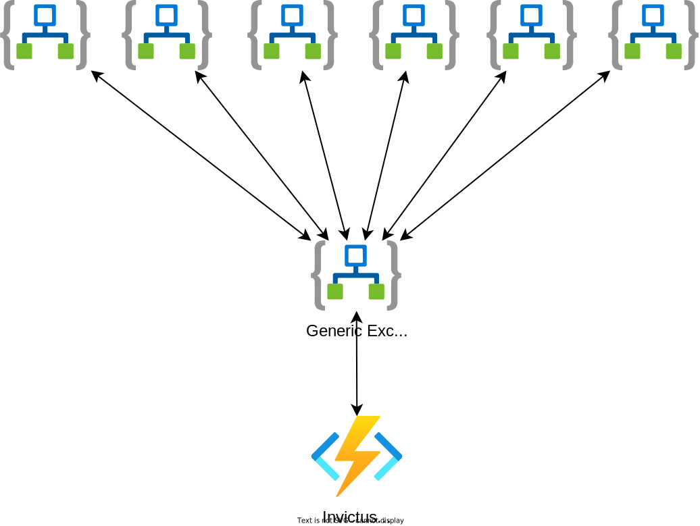
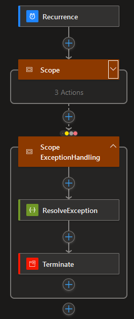
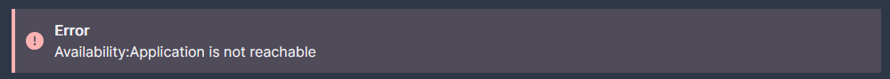

# Exception Handler

Everyone who has worked with Logic Apps is familiar with the error `An action failed. No dependent actions succeeded`. This is a very generic error that offers no clear information on what went wrong.

The Exception Handler function can be used to retrieve the actual error message from a Logic App and optionally translate this to a human readable text.
For more information on the translations and how to set this up see [here](#Translations).

:thumbsup: The Exception Handler function supports both Logic App Consumption and Logic App Standard.

## ResolveException Endpoint

The function contains a single `ResolveException` endpoint. 

### Logic App Consumption

If you want to resolve the exception of a Logic App Consumption use the following body:

``` json
{
  "WorkflowRunId": "<the workflow run id of the failed Logic App>",
  "WorkflowName": "<the name of your Logic App>",
  "SubscriptionId": "<your subscription id>",
  "ResourceGroupName": "<the resourcegroup name of the failed Logic App>",
  "Type": "Consumption",
  "SiteName": null
}
```

An example:
``` json
{
  "WorkflowRunId": "08584773878007282344320782622CU00",
  "WorkflowName": "cdt-dev-we-somelogicapp",
  "SubscriptionId": "fb0519a2-b69f-4cdf-97ff-19735685b5b9",
  "ResourceGroupName": "some-resource-group",
  "Type": "Consumption",
  "SiteName": null
}
```

### Logic App Standard

If you want to resolve the exception of a Logic App Standard workflow use the following body:

``` json
{
  "WorkflowRunId": "<the workflow run id of the failed Logic App workflow>",
  "WorkflowName": "<the name of your Logic App workflow>",
  "SubscriptionId": "<your subscription id>",
  "ResourceGroupName": "<the resourcegroup name of the failed Logic App workflow>",
  "Type": "Standard",
  "SiteName": "<the Logic App site name>"
}
```

An example:
``` json
{
  "WorkflowRunId": "08584773878007282344320782622CU00",
  "WorkflowName": "ProcessMessage",
  "SubscriptionId": "fb0519a2-b69f-4cdf-97ff-19735685b5b9",
  "ResourceGroupName": "some-resource-group",
  "Type": "Standard",
  "SiteName": "cdt-dev-we-somelogicapp"
}
```

### Response
The function will respond with a list of errors for the failed actions, for example:
``` json
{
    "status": "Failed",
    "code": "InvalidURL",
    "description": "Http request failed with status code 'HostNotFound' and status message: 'No such host is known.'.",
    "errors": [
        {
            "code": "InvalidURL",
            "description": "Http request failed with status code 'HostNotFound' and status message: 'No such host is known.'."
        }
    ]
}
```

## Access Rights

The ExceptionHandler function requires the role `Logic App Contributor` and additionally `Website Contributor` (for Logic App Standard) to operate correctly. These must be assigned on the ExceptionHandler function to the resource group where the Logic Apps are located.

## Translations

:bulb: The ExceptionHandler function makes use of the [RegexTranslator](https://github.com/invictus-integration/docs-ifa/blob/master/framework/components/regextranslation.md) component to translate the original error from the Logic App.

:flashlight: To show what we mean by translating the error to a human readable text let's take the following example.

We have a Logic App that used to return the generic `An action failed. No dependent actions succeeded` error, by using the Exception Handler we have now improved this to the actual error which is `Http request failed with status code 'HostNotFound' and status message: 'No such host is known.'.`.

However, we have a business user that does not really understand what this means. By using the translation functionality of the Exception Handler function we can translate this error to something like `Application is not reachable` which the business user can clearly understand.

These translations must be set up in the `RegexTranslator` table in your Invictus storage account. Translations need to be added in the table as follows:

### Logic App Consumption

| PartitionKey            | RowKey     | MatchPattern                           | OutputPattern                                           |
|-------------------------|------------|----------------------------------------|---------------------------------------------------------|
| logicappname.actionname | Any RowKey | The pattern to be matched in the error | code(YourTranslationCode)The output translation pattern |

Some examples:

| PartitionKey                                   | RowKey | MatchPattern                                                                    | OutputPattern                                                |
|------------------------------------------------|--------|---------------------------------------------------------------------------------|--------------------------------------------------------------|
| cdt-dev-we-somelogicapp.CallHTTP               | 1      | No such host is known                                                           | code(Availability)Application is not reachable               |
| cdt-dev-we-somelogicapp.Create                 | 1      | cannot be evaluated because array index '0' cannot be selected from empty array | code(Account)The accountid for the debtor could not be found |
| cdt-dev-we-somelogicapp.ParseJSON              | 1      | Invalid JSON schema type: int                                                   | code(Data)The field is not an integer                        |
| cdt-dev-we-somelogicapp.ExecuteStoredProcedure | 1      | Procedure or function 'upsertData' expects parameter '@Ordernumber'             | code(Data)Ordernumber is not supplied but is required        |

### Logic App Standard

| PartitionKey                     | RowKey     | MatchPattern                           | OutputPattern                                           |
|----------------------------------|------------|----------------------------------------|---------------------------------------------------------|
| sitename.workflowname.actionname | Any RowKey | The pattern to be matched in the error | code(YourTranslationCode)The output translation pattern |

Some examples:

| PartitionKey                                                  | RowKey | MatchPattern                                                                    | OutputPattern                                                |
|---------------------------------------------------------------|--------|---------------------------------------------------------------------------------|--------------------------------------------------------------|
| cdt-dev-we-somelogicapp.ProcessMessage.CallHTTP               | 1      | No such host is known                                                           | code(Availability)Application is not reachable               |
| cdt-dev-we-somelogicapp.ProcessMessage.Create                 | 1      | cannot be evaluated because array index '0' cannot be selected from empty array | code(Account)The accountid for the debtor could not be found |
| cdt-dev-we-somelogicapp.ProcessMessage.ParseJSON              | 1      | Invalid JSON schema type: int                                                   | code(Data)The field is not an integer                        |
| cdt-dev-we-somelogicapp.ProcessMessage.ExecuteStoredProcedure | 1      | Procedure or function 'upsertData' expects parameter '@Ordernumber'             | code(Data)Ordernumber is not supplied but is required        |

### Response With Translation

By using the translation functionality we will get back the following response:

``` json
{
   "status": "Failed",
    "code": "Availability",
    "description": "Application is not reachable",
    "errors": [
        {
            "code": "Availability",
            "description": "Application is not reachable"
        }
    ]
}
```

### Ignoring Errors

By using the translation functionality we can also ignore errors. This can be very useful for scenario's where Logic Apps can generate an error that is not relevant to the business and the flow can be seen as successful. 

Let's take an example where we have a Logic App that picks up a file from a network location and after it has been published will delete the file. We have seen situations at customers where this delete action will fail because the file has already been removed by another instance of the Logic App, this error can be safely ignored since the message is processed anyway.

To achieve this we can configure the translation as follows:

| PartitionKey                       | RowKey | MatchPattern               | OutputPattern |
|------------------------------------|--------|----------------------------|---------------|
| cdt-dev-we-somelogicapp.DeleteFile | 1      | There is no file with name | ignore        |

This will result in the following response:

``` json
{
    "status": "Succeeded",
    "code": "NoCodeSpecified",
    "description": "",
    "errors": []
}
```

## Guideline On How To Implement The Exception Handler

A good way to implement the Exception Handler is to create a common exception handler Logic App that will call the Exception Handler function and return the response. This common Logic App can then be called by all other Logic Apps, this is a nice way to centralize your exception handling functionality.

:bulb: use a webhook to call the common exception handler Logic App so that if anything fails in the common Logic App you can resubmit this and return the response asynchronously.



See an example of how to call the common exception handler Logic App and process the response:



The code for the `Scope Exception Handling` is shown below, pay attention to the `Terminate` action as this uses the information from the Exception Handler function and is nicely shown in the Invictus for Azure dashboard.



``` json
"Scope_ExceptionHandling": {
  "actions": {
	"ResolveException": {
	  "inputs": {
		"subscribe": {
		  "body": {
			"callbackurl": "@{listCallbackUrl()}",
			"logicApp": "@{workflow().name}",
			"resourceGroup": "@{parameters('resourceGroupName')}",
			"run": "@{workflow()['run']['name']}",
			"subscription": "@{parameters('subscriptionId')}",
			"correlationId": "@trigger().clientTrackingId"
		  },
		  "method": "POST",
		  "uri": "[listCallbackUrl(resourceId(variables('exceptionHandlerResourceGroupName'), 'Microsoft.Logic/workflows/triggers', variables('exceptionHandlerLogicAppName'), 'manual'), providers('Microsoft.Logic', 'workflows').apiVersions[0]).value]"
		},
		"unsubscribe": {}
	  },
	  "runAfter": {},
	  "type": "HttpWebhook"
	},
	"Terminate": {
	  "inputs": {
		"runError": {
		  "code": "@{if(equals(body('ResolveException').Status, 'Failed'), body('ResolveException').code, null)}",
		  "message": "@{if(equals(body('ResolveException').Status, 'Failed'), body('ResolveException').description, null)}"
		},
		"runStatus": "@{body('ResolveException').Status}"
	  },
	  "runAfter": {
		"ResolveException": [
		  "Succeeded"
		]
	  },
	  "type": "Terminate"
	}
  },
  "runAfter": {
	"Scope": [
	  "Failed",
	  "Skipped",
	  "TimedOut"
	]
  },
  "type": "Scope"
}
```
