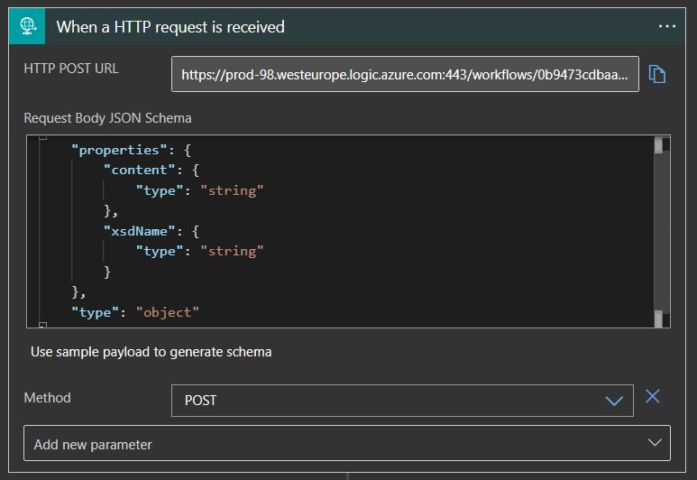
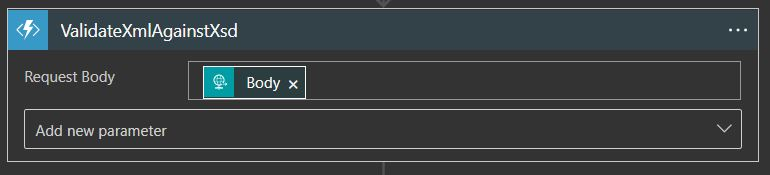
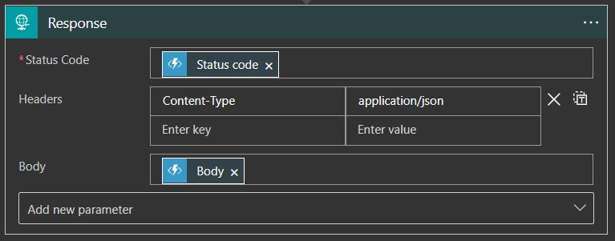

# XSD - Validator

## Introduction

This documentation will give you an overview of the XSD Validator component and will help you use it.

### Overview

The scope of the XSD validator is to validate a supplied XML (in Base64 format) against an XSD. XSDs with includes are supported. All XSDs are to be stored in the Azure Storage Container **xsdvalidatorstore**.

## Input

As an input, the XML in Base64 format (**content**) and the name of the XSD file (**xsdName**) need to be supplied as follows:

`{
	"content": "PD94bWwgdmVyc2lvbiA9ICIxLjAiPz4KPGNsYXNzPiAgCiAg...",   
    "xsdName": "valid-sample.xsd"
}`

When setting up your Logic App, the HttpRequest is to be setup as follows:

The request is then followed by the execution of the function **ValidateXmlAgainstXsd** as follows:

## Output

After the XML is validated against the XSD, the result for a successful validation is returned with **IsValid** as true, with no **Exceptions** as follows:

`{
    "IsValid": true,
    "Exceptions": []
}`

If the validation is unsuccessful, the output is returned with **IsValid** as false, together with a list of **Exceptions** as follows:

`{
    "IsValid": false,
    "Exceptions": [
        {
            "message": "The element 'student' has invalid child element 'lastname'. List of possible elements expected: 'firstname'."
        }
    ]
}`

The response to the function **ValidateXmlAgainstXsd** is to be setup as follows:

