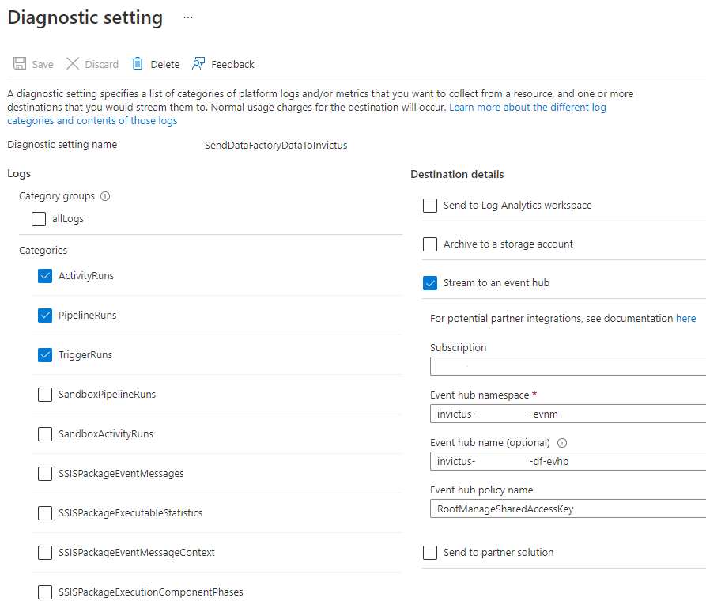

# Enable DataFactory Diagnostics
For the Invictus Dashboard to know if messages went through your DataFactory pipelines correctly or not, diagnostic settings need to be configured on all pipelines you want to include. These settings should stream their diagnostic traces to the Invictus EventHubs resource:

* `EventHubsNamespace`: `invictus-{env}-we-sft-evnm`
* `EventHubsName`: `invictus-{env}-we-sft-df-evhb`

> ⚠️ Make sure that the following categories are checked:
>   * ✅ `PipelineRuns`
>   * ✅ `TriggerRuns`
>   * ✅ `ActivityRuns`



See [Microsoft's documentation](https://learn.microsoft.com/en-us/azure/data-factory/monitor-configure-diagnostics) on how this can be configured manually.

Alternatively, you can update your Bicep template to include them:

```bicep
resource factoryName_microsoft_insights_settingName 'Microsoft.DataFactory/factories/providers/diagnosticSettings@2017-05-01-preview' = {
  name: '${factoryName}/microsoft.insights/${settingName}'
  location: resourceGroup().location,
  properties: {
    workspaceId: null,
    storageAccountId: null
    eventHubAuthorizationRuleId: 'RootManageSharedAccessKey',
    eventHubName: 'invictus-{env}-we-sft-df-evhb',
    logs: [
      {
        category: 'PipelineRuns'
        enabled: true,
        retentionPolicy: {
          enabled: false,
          days: 0
        }
      }
      {
        category: 'TriggerRuns'
        enabled: true,
        retentionPolicy: {
          enabled: false,
          days: 0
        }
      }
      {
        category: 'ActivityRuns'
        enabled: true,
        retentionPolicy: {
          enabled: false,
          days: 0
        }
      }
    ]
  }
  dependsOn: [
    datafactory
  ]
}
```
