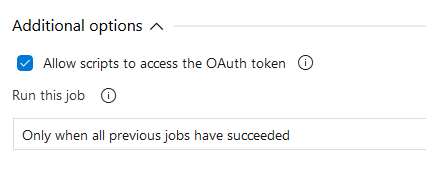

# Release Pipeline

The release pipeline will use the artifacts created from the build pipeline and publish this to the stage(s) you define. Each stage will deploy the resources to the Azure subscription and resource group you specify in the deployment tasks.

The release uses variable groups and edits/adds variables to the groups, we will begin by creating a new variable group.

## Variable Group

Create a variable group named {prefix}.Invictus.{stage} for all the stages (environments) and add at least one variable (eg: Invictus.Secrets.ApiKey1.Name = apikey1).

Make sure the Project Collection Build Service has Administrator access to these variable groups (Pipelines > Library > Security)

> 

## Release

Create a new release pipeline, starting with an empty template, with this naming: `{prefix}.Invictus.Framework`.

Configure the release name format (Options) as `{prefix}.Invictus.Framework $(Build.BuildNumber)_$(rev:r)`.

Use the Artifacts from the build pipeline as a source for the release. Name the Source alias: "InvictusFramework".

Add a variable **ArtifactsPath** to the release with scope 'Release' and a value of `$(System.DefaultWorkingDirectory)/InvictusFramework/Framework`.

### Stages

Add a stage for each environment you wish to release to.

- Link the above variable groups to the stages you create.
- Don't forget to link the Infra variable group as well.
- Allow the agent to access the OAuth token

> 

Add an Azure PowerShell task to each stage. This task will take care of the following:

- Get the keyvault access policies, so they are preserved in consequent deployments.
- Stop any datafactory triggers related to the framework.
- ARM deployment.
- Start any datafactory triggers.
- Deployment of the framework components.

Use the following arguments for the fields of the azure powershell task:

- **Task version**: 4
- **Display name**: Deploy
- **Azure Subscription**: the subscription to deploy to
- **Script Path**: `$(ArtifactsPath)/Deploy.ps1`
- **Script Arguments**
  - ArtifactsPath (mandatory): `$(ArtifactsPath)`
  - ArtifactsPathScripts (optional): uses ArtifactsPath if not specified.
  - ResourcePrefix (mandatory): `$(Infra.Environment.ShortName)-$(Infra.Environment.Region.Primary.ShortName)-$(Infra.Environment.Customer.ShortName)` 

