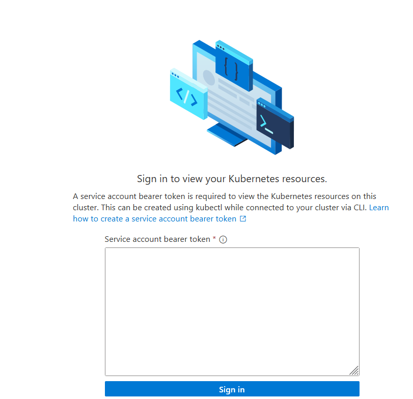

# Install guide
This installation guide will walk through the process of installing the Invictus framework components in a hybrid setting on on-premise environments. 

## Install prerequisites
We support both Linux and Windows installations. Please make sure that the necessary prerequisites services are installed by following these steps:
* [Linux](./prerequisites/installguide-linux.md) (🥇 Recommended)
* [Windows](./prerequisites/installguide-windows.md)

## Deploy HELM chart
login to the acr to pull the helm chart
```shell
> helm registry login invictusdevacracr.azurecr.io --username {username} --password {password}
```
todo: update this to master before pull request
```shell
> helm upgrade \
  --install {name} oci://invictusdevacracr.azurecr.io/helm/invictus-on-premise \
  --version 1.0.0 \
  --set imagePullSecret.username={username} \
  --set imagePullSecret.password={password} \
  --set Framework.APPINSIGHTS_INSTRUMENTATIONKEY={appinsights_instrumentationkey} \
  --set SQL.sapassword={sqlpassword} \
  --set rabbitMQ.authentication.password={rabbitmqpassword} \
  --set rabbitMQ.authentication.erlangCookie={erlangcookie} \
  --set tag={releaseverion}
```

Replace the bracketed values with your own variables:
| Variable                           | Description                                                                               |
| ---------------------------------- | ----------------------------------------------------------------------------------------- |
| `{name}`                           | Your release name of the helm deployment (free to choose)                                 |
| `{username}`                       | Username given by Codit ([contact us](mailto:coditproducts@codit.eu))                     |
| `{password}`                       | Password given by Codit ([contact us](mailto:coditproducts@codit.eu))                     |
| `{appinsights_instrumentationkey}` | An instrumantation key of your Azure Application Insights (needs to be manually deployed) |
| `{sqlpassword}` **                 | SQL server password for the SA account (will be generated on deploy)                      |
| `{rabbitmqpassword}`               | Password for your RabbitMQ (will be generated during deploy)                              |
| `{erlangcookie}`                   | RabbitMQ cookie string (free to choose, will be used during RabbitMQ deploy)              |
| `{releaseverion}`                  | WHat release version of Invictus you want to deploy (`70508` is the latest version)  |

** 🚩 When you already have a SQL server running on your machine, use `--set SQL.existingSQLConnectionString` to specify the connection string directly.

### Optional settings
In the `README.md` you can find all the optional parameters.
Some interesting are:
If the below parameters are set, the corresponding resource will not be created on the cluster but will instead use the provided connection string
```shell
--set existingSQLConnectionString={connectionstring}
--set PubSub.RmqConnectionString={amqpconnectionstring}
--set existingDurableSQLConnectionString={durableconnectionstring}
```

If you want to deploy it into an other namespace the default
`-n {namespace}`

## Enable arc
run arc.ps1
```shell
> powershell .\arc.ps1 {name} {resource-group} {serviceaccount}
```
| Variable           | Description                                                      |
| ------------------ | ---------------------------------------------------------------- |
| `{name}`           | wanted name arc cluster                                          |
| `{resource-group}` | resource group for the arc cluster                               |
| `{serviceaccount}` | the name of the kubernetes service account it uses for the token |

at the end the script returns a bearer token. that one is used the authenticate in the portal.



## or

Login to Azure:

```shell
> az login
```

Register providers for Azure Arc-enabled Kubernetes
```shell
> az provider register --namespace Microsoft.Kubernetes
> az provider register --namespace Microsoft.KubernetesConfiguration
> az provider register --namespace Microsoft.ExtendedLocation
```

Connect an existing Kubernetes cluster
```shell
> az connectedk8s connect --name {name} --resource-group {resource-group}
```

| Variable           | Description                        |
| ------------------ | ---------------------------------- |
| `{name}`           | wanted name arc cluster            |
| `{resource-group}` | resource group for the arc cluster |

> The command may ask to install the extension `connectedk8s` if it is not installed on the system. A outdated version of `az` may also result in problems running this extension. Try upgrading the Azure CLI with `az upgrade` and run the command again.

