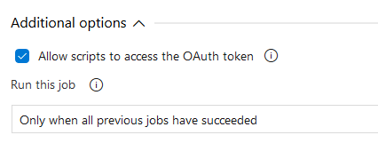

[home](../../README.md) | [framework](../framework.md) | [framework installation](framework-installation.md)

# Framework Release Pipeline

The release pipeline will use the artifacts created from the build pipeline and publish this to the stage(s) you define. Each stage will deploy the resources to the Azure subscription and resource group you specify in the deployment tasks.

The release uses variable groups and edits/adds variables to the groups, we will begin by creating a new variable group.

## Variable Group

Create a variable group named {prefix}.Invictus.{stage} for all the stages (environments) and add at least one variable (eg: Invictus.Secrets.ApiKey1.Name = apikey1).

Make sure the Project Collection Build Service has Administrator access to these variable groups (Pipelines > Library > Security)

> 

## YAML Pipeline
Add the files and folders from [this](./pipelines) location to your DevOps repo. 
This contains an example YAML pipeline to release the Invictus for Azure Framework, change the [framework.release.yaml](./pipelines/framework.release.yaml) file according to your needs, for example change the needed environments and change the name of the build pipeline trigger:
``` yaml
resources:
  pipelines:
    # Name of the pipeline resource inside this workflow. Used to reference the pipeline resources later on (e.g. download artifacts).
  - pipeline: _build
    # Name of the build pipeline in Azure Pipelines
    source: 'customer.azure.invictus.framework.build' 
    trigger: true
```

**Make sure to replace the `azureSubscription` value with the name of your serviceconnection as this value cannot be parameterized**

Also make sure to change the ARM template parameters. In these example files we are deploying to DEV, TST and ACC using a `B1` service plan SKU and a `P1V2` service plan SKU to PRD. Make sure to change and parameterize this according to your needs.

If you need to overwrite more ARM Template parameters make sure to add this to the `deployScriptParameters`. A complete list of ARM Template parameters can be found [here](#ARM-Template-Parameters). 

Afterwards add the [framework.release.yaml](./pipelines/framework.release.yaml) in your DevOps environment as a pipeline.

## Classic Pipeline
### Release

Create a new release pipeline, starting with an empty template, with this naming: `{prefix}.Invictus.Framework`.

Configure the release name format (Options) as `{prefix}.Invictus.Framework $(Build.BuildNumber)_$(rev:r)`.

Use the Artifacts from the build pipeline as a source for the release. Name the Source alias: "InvictusFramework".

Add a variable **ArtifactsPath** to the release with scope 'Release' and a value of `$(System.DefaultWorkingDirectory)/InvictusFramework/Framework`.

Please Note that a current bug in the Az library might cause the release to fail for new installation. Simply re-deploy the failed release to resolve the issue.

#### Stages

Add a stage for each environment you wish to release to.

- Link the above variable groups to the stages you create.
- Don't forget to link the Infra variable group as well.
- Allow the agent to access the OAuth token

> 

Add an Azure PowerShell task to each stage. This task will take care of the following:

- Get the keyvault access policies, so they are preserved in consequent deployments.
- Stop any datafactory triggers related to the framework.
- ARM deployment.
- Start any datafactory triggers.
- Deployment of the framework components.

Use the following arguments for the fields of the azure powershell task:

- **Task version**: 4
- **Display name**: Deploy
- **Azure Subscription**: the subscription to deploy to
- **Script Path**: `$(ArtifactsPath)/Deploy.ps1`
- **Script Arguments**
  - ArtifactsPath (mandatory): `$(ArtifactsPath)`
  - ArtifactsPathScripts (optional): uses ArtifactsPath when not specified.
  - ResourcePrefix (mandatory): `$(Infra.Environment.ShortName)-$(Infra.Environment.Region.Primary.ShortName)-$(Infra.Environment.Customer.ShortName)`
  - ResourceGroupName (mandatory): name of the Azure Resource Group. Include the variable `$(Infra.Environment.ShortName)` to make this environment specific.
  - VariableGroupName (mandatory): The name of the variable group. Include the variable `$(Infra.Environment.ShortName)` to make this environment specific.
  - ResourceGroupLocation (optional): `$(Infra.Environment.Region.Primary)` or 'West Europe' when not specified.
  - KeyVaultName (optional): uses `invictus-$ResourcePrefix-vlt` when not specified.
  - KeyVaultAccessPoliciesVariableName (optional): uses _Infra.KeyVault.AccessPolicies_ when not specified.
  - AdditionalTemplateParameters (optional): Additional named parameters for the arm template you wish to override. More on this below.
- **Azure PowerShell Version**: Specify other version : **2.6.0**

**NOTE:** When passing the ApiKey1 and ApiKey2 to the Deploy.ps as arguments, please remember to enclose them in single quotes ''. This prevents any operator characters from breaking the ps script.

The AdditionalTemplateParameters argument are named arguments you can use to override the default values used by the ARM template. You simply name the argument as the parameter. For example if you want to use a different servicePlanSku you would add `-servicePlanSkuName "S1"` to the arguments of the powershell script.

> Note that **accessPolicies** are overridden by the script, so no need to include that in the arguments.

Complete example of the arguments (note the use of -devOpsObjectId as an additional parameter):

```powershell
-ArtifactsPath "$(ArtifactsPath)" -ResourcePrefix "$(Infra.Environment.ResourcePrefix)" -ResourceGroupName "$(Infra.Environment.ResourceGroup)" -VariableGroupName "Software.Infra.$(Infra.Environment.ShortName)" -ResourceGroupLocation "$(Infra.Environment.Region.Primary)" -devOpsObjectId $(Infra.DevOps.Object.Id)
```

A complete list of ARM Template parameters can be found [here](#ARM-Template-Parameters). 

## ARM Template Parameters

The below table lists the parameters accepted by the ARM template.

|Parameter Name|Required|Default Value|Description|
| --- | :---: | --- | --- |
|resourcePrefix|Yes||used as part of the default names for most resources.|
|apiKey1|No|Generated value|The value used for basic authentication for the APIs|
|apiKey2|No|Generated value|The value used for basic authentication for the APIs|
|sqlServerName|No|invictus-{resourcePrefix}-sqlsvr|The name for the SQL Server that will host the databases|
|sqlServerLogin|No|InvictusFrameworkAdmin|The default username set for SQL Server|
|sqlServerLoginPassword|No|Generated value|The password that will be set to login into SQL Server|
|dashboardDatabaseName|No|coditcip|The name of the Database used by the Dashboard|
|timesequencerFunctionName|No|invictus-{resourcePrefix}-timesequencer|Name for the time sequencer Web API|
|pubSubWebAppName|No|invictus-{resourcePrefix}-pubsubapp|Name for the PubSub Web API|
|matrixWebAppName|No|invictus-{resourcePrefix}-matrixapp|Name for the Matrix Web API|
|transcoWebAppName|No|invictus-{resourcePrefix}-transcoapp|Name for the Transco Web API|
|serviceBusNamespaceName|No|invictus-{resourcePrefix}-sbs|Name for the Service Bus Namespace resource|
|serviceBusSkuName|No|Standard or Premium if VNET enabled|Name for the Service Bus SKU|
|keyVaultName|No|invictus-{resourcePrefix}-vlt|Name for the Key Vault Service Namespace resource|
|keyVaultEnablePurgeProtection|No|false|If true, enables key vault purge protection|
|storageAccountName|No|invictus{resourcePrefix}store|Name for the Azure Storage resource. Any dashes (-) will be removed from {resourcePrefix}|
|blobContainerPrefix|No|invictus|Prefix set for blob containers for pubsub|
|approvedMessageSizeInBytesKey|No|200000|The max allowed message size before pushing message to Blob when using PubSub|
|appInsightsName|No|invictus-{resourcePrefix}-appins|Name for the Application Insights resource|
|servicePlanName|No|invictus-{resourcePrefix}-appplan|Name for the service plan which will host the APIs|
|serviceBusMessageTimeToLiveMinutes|No|-1|Time messages should be stored on service bus before being archived|
|storageAccountType|No|Standard_LRS|The Storage account StorageAccountSkuType|
|invictusFrameworkBasicUser|No|Invictus|The username used for Basic Authentication for the APIs|
|servicePlanSkuName|No|S1|Size for the App Plan, the value of "I1" needs to be passed to install an isolated plan.|
|servicePlanSkuCapacity|No|1|The SKU capacity setting  for the App Plan|
|autoscaleForPlanName|No|invictus-{resourcePrefix}-CPU-RAM-Autoscale|Name for the autoscale function|
|minPlanInstanceAutoScale|No|1|The minimum number of instances for the AutoScale function|
|maxPlanInstanceAutoScale|No|5|The maximum number of instances for the AutoScale function|
|buildtype|No|production|Always leave this property as "production". This created a DB used internally for testing.|
|consumptionPlanName|No|invictus-{resourcePrefix}-consumptionplan|Name of consumption app plan|
|dashboardDbSkuName|No|S1|The SKU name of the CoditCip DB|
|dashboardDbSkuTier|No|Standard|The Tier name for the CoditCip DB|
|dashboardDbMaxSizeBytes|No|268435456000|Default size of CoditCip DB when created|
|mTriggerCpuTimeGrainAutoScaleIncrease|No|PT5M|Time evaluated when factoring enabling autoscale for CPU|
|mTriggerCpuTimeGrainAutoScaleDecrease|No|PT5M|Time evaluated when factoring enabling autoscale for CPU|
|mTriggerRamTimeGrainAutoScaleIncrease|No|PT5M|Time evaluated when factoring enabling autoscale for RAM|
|mTriggerRamTimeGrainAutoScaleDecrease|No|50|Percentage when rule is triggered|
|mTriggerCpuTimeWindowAutoScaleIncrease|No|PT5M|Time evaluated when factoring enabling autoscale for CPU|
|mTriggerCpuTimeWindowAutoScaleDecrease|No|PT5M|Time evaluated when factoring enabling autoscale for CPU|
|mTriggerCpuThresholdAutoScaleIncrease|No|70|Percentage when rule is triggered|
|mTriggerCpuThresholdAutoScaleDecrease|No|50|Percentage when rule is triggered|
|mTriggerRamTimeWindowAutoScaleIncrease|No|PT5M|Time evaluated when rule is triggered|
|mTriggerRamTimeWindowAutoScaleDecrease|No|PT5M|Time evaluated when rule is triggered|
|mTriggerRamThresholdAutoScaleIncrease|No|70|Percentage when rule is triggered|
|mTriggerRamThresholdAutoScaleDecrease|No|50|Percentage when rule is triggered|
|scaleActionCpuCooldownTimeAutoScaleIncrease|No|PT5M|Time evaluated when factoring enabling autoscale for CPU|
|scaleActionCpuCooldownTimeAutoScaleDecrease|No|PT5M|Time evaluated when factoring enabling autoscale for CPU|
|scaleActionRamCooldownTimeAutoScaleIncrease|No|PT5M|Time evaluated when factoring enabling autoscale for RAM|
|scaleActionRamCooldownTimeAutoScaleDecrease|No|PT5M|Time evaluated when factoring enabling autoscale for RAM|
|pubSubWebAppAlwaysOn|No|true|Always on Setting for WebApp|
|matrixWebAppAlwaysOn|No|true|Always on Setting for WebApp|
|transcoWebAppAlwaysOn|No|true|Always on Setting for WebApp|
|accessPolicies|No|[]|A list of Azure Key vault access policies|
|devOpsObjectId|Yes||The object-id associated with the service principal of the enterprise application that's connected to the service connection on DevOps|

### VNET Specific Parameters

|Parameter Name|Required for VNET|Default Value|Description|
| --- | :---: | --- | --- |
|enableVnetSupport|Yes|false|Used to toggle VNET functionality on or off|
|vnetResourceGroupName|Yes|&nbsp;|The name of the resource group on Azure where the VNET is located|
|vnetName|Yes|&nbsp;|The name of the VNET resource|
|keyVaultSubnets|Yes|[]|An array of string. The values need to match the subnet names on the VNET|
|storageAccountSubnets|Yes|[]|An array of string. The values need to match the subnet names on the VNET|
|serviceBusSubnets|Yes|[]|An array of string. The values need to match the subnet names on the VNET|
|functionsSubnetName|Yes||The name of the subnet to be used to connect the azure function resources|
|privateEndpointSubnetName|Yes||The name of the subnet to be used to connect the private endpoint resources|
