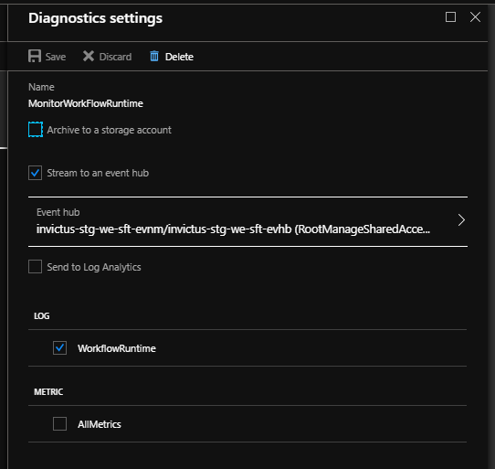

# Enable LogicApps Diagnostics
For the Invictus Dashboard to know if messages went through your Logic App workflow correctly or not, diagnostic settings need to be configured on all Logic Apps that you want to include. These settings should stream their diagnostic traces to the Invictus EventHubs resource:

* `EventHubsNamespace`: `invictus-{env}-we-sft-evnm`
* `EventHubsName`: `invictus-{env}-we-sft-evhb-v2`

> ⚠️ Make sure that the `WorkflowRuntime` is **✅ checked**, but the `AllMetrics` is **❌ unchecked**. Otherwise you will send far too much events to the EventHubs.



> 🔗 See [Microsoft's documentation](https://learn.microsoft.com/en-us/azure/logic-apps/monitor-workflows-collect-diagnostic-data?tabs=consumption) on how this can be configured manually.

Alternatively, you can update your Bicep template to include them, using [AVM](https://github.com/Azure/bicep-registry-modules/tree/main/avm/res/logic/workflow#parameter-diagnosticsettings):

```bicep
{
  ...
  diagnosticSettings: [
      {
        name: settingName
        eventHubName: eventHubName
        eventHubAuthorizationRuleResourceId: resourceId(
          resourceGroupName,
          'Microsoft.EventHub/namespaces/authorizationRules',
          eventHubNamespace,
          'RootManageSharedAccessKey'
        )
        logCategoriesAndGroups: [
          {
            category: 'WorkflowRuntime'
            enabled: true
          }
        ]
      }
    ]
}
```