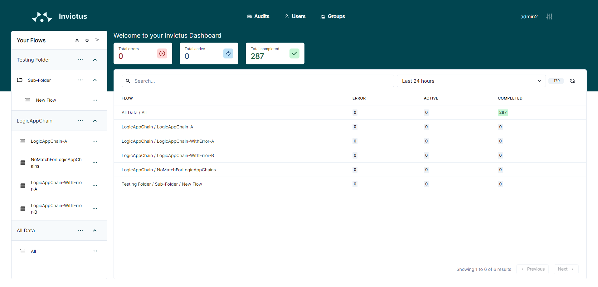

# Dashboard Home Page

The dashboard home page shows you an overview of the current status of all your flows (= message chain). Flows are an aggregation of all diagnostic traces that can be linked to the same incoming message. Besides predefined properties, it can have optional custom properties to give context to the user.

The aggregated status of the messages received by that flow can be:
* **Active:** messages currently being processed by the flow.
* **Completed:** messages completed successfully by the flow.
* **Error:** messages suspended, dehydrated or terminated by the flow.

> 👆 Clicking on the flow name will redirect you to the details of that flow.
>
> 👆 Clicking on a status will redirect you to the search page to list all flows of that status. 

