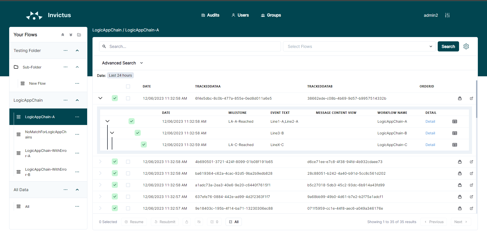
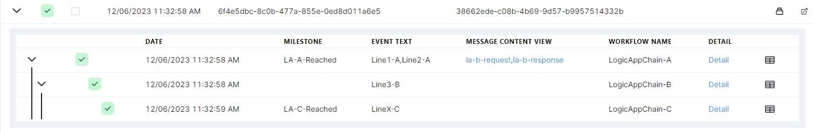
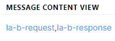
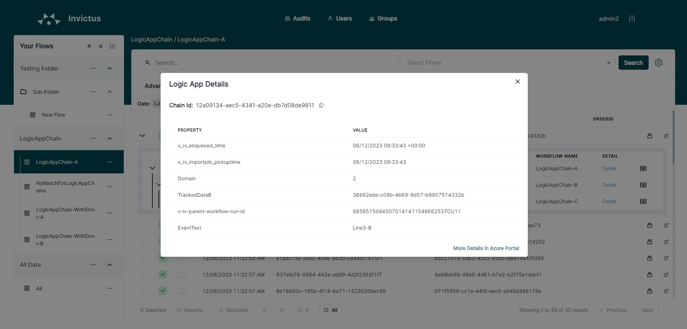
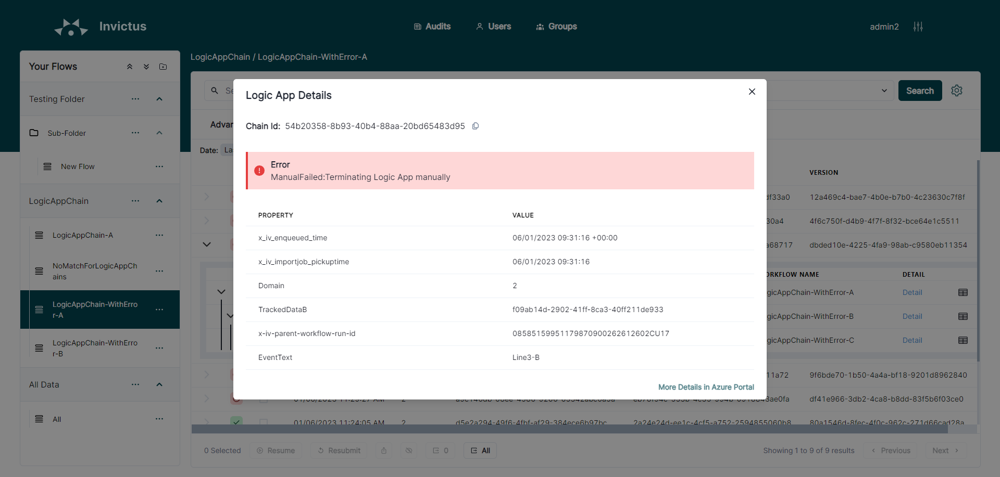

[home](../README.md) | [dashboard](dashboard.md)

# Dashboard Execution Tree

The Execution Tree or also commonly referred to as the "Clickthrough" or "Workflow Events" corresponds to the details of the execution following a certain flow, which corresponds to all the executed Logic Apps inside the flow. 

To see the execution tree, choose any message and click on the downward chevron button.

Within this view it is also possible:

* To see if a certain logic app execution was successful or failed.
* To see the tracked properties, errors on the logic app level and to navigate to the Azure portal.

### Milestone and Event Text

The Milestone and EventText are properties set and displayed by default. For the EventText, if the value re-appears in several logic apps, instead of overwriting/updating its value, all data is appended as a single value, separated by comma.

### Message Content View

For this feature to function properly some role assignments need to be set in your Invictus installation. Please see [Access Control Rights](accesscontrolrights.md) for more info.

The message content view allows the user to track the outputs and inputs of an action. The image below shows an example of the input and output of an action being tracked. These are visible per LogicApp in the workflow events table. 

The links in the above image are the friendly names set in the tracked properties of the "tracked" action. When one of the links is clicked, a new tab will open with the content of either the input or the output.

**To track the input and output of an action in a logicapp the below tracked properties have to be set in an action.**

|Property Name|Required|Sample Value|Description|
| --- | :---: | --- | --- |
|x-iv-messagecontent-input-name|Yes(if the input content type is present)|ActionInput|This is the friendly name displayed in the ClickThrough/ExecutionTree, the value can be anything you like. The value has to be a single word|
|x-iv-messagecontent-input-content-type|Yes(if the input name is present)|application/json|This should have the same content type as the data type when opening the input link for an action|
|x-iv-messagecontent-output-name|Yes(if the output content type is present)|ActionOutput|This is the friendly name displayed in the ClickThrough/ExecutionTree, the value can be anything you like. The value has to be a single word|
|x-iv-messagecontent-output-content-type|Yes(if the output name is present)|application/json|This should have the same content type as the data type when opening the input link for an action|

The inputs and outputs content views can be set up independently or together. The only requirement is that if the "-name" is present then the "-content-type" has to be also present for the desired output.

### Tracked Properties

To see the tracked properties of the workflow events, click on the "Logic App Details" button at the right of each event. A modal will popup showing all the tracked properties available on every logic app inside the flow.

> Please note that search capabilities do not apply to this feature.

### Errors on Logic App level

If the corresponding logic app has resulted in an error, the error information can be seen in the within the "Logic App Details" modal.

For any additional details or insights, the user can also navigate directly to the Azure Portal.
