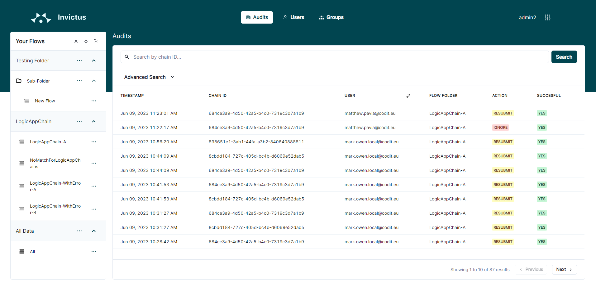
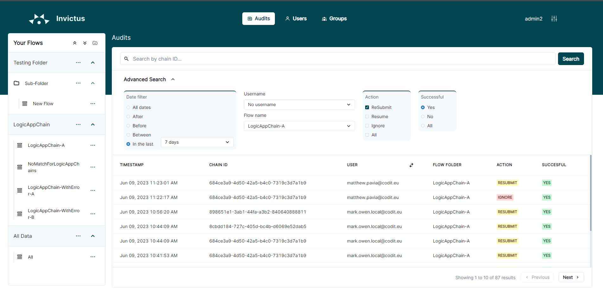

[home](../README.md) | [dashboard](dashboard.md) | [Flow Auditing](flowauditing.md)

# Flow Auditing

Only system admins have access to the audit page. A button taking you the audits page will be visible in your top navbar. A system admin can see all the audits for every flow that exists.

Data will be retrieved from the past 24 hours by default. Further refinement to the date range can be made by opening the "Advanced Search" pane and selecting your desired option. More filters are also available here, allowing you to filter via the audit username, flow name, audit action and whether the action was successful or not. The user can also search via the Chain ID to retrieve the specific audits for a logic app chain.

