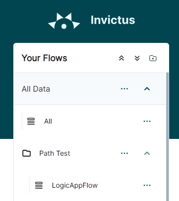

# Organizing flows in folders

To have a clear overview of your desired flows, the Invictus Dashboard allows you to organize your flows into a folder hierarchy (with possibly one or more sub-folders).

👇 The following example shows a root folder `All Data` with a sub-folder `Path Test`. Flows are present on the root folder (`All`) as well as the sub-folder (`LogicAppFlow`).

> 💡 Flow detail URL's can be constructed that will redirect users to the details page of the flow, but following the breadcrumb path of the flow.
>
> `https://{your-dashboard-url}/flowpath/All Data/Path Test/LogicAppFlow`
>
> ⚠️ Make sure that both the folder and the flow's name is unique horizontally so that the breadcrumb only points to a single flow.

## Edit folders
> 👉 **Home > Your Flows >  ••• [Create/Edit/Delete] folder**

Folders and sub-folders can be created, edited and archived, depending on the [role permissions](./role-management.md) on that folder. Only a name is required and possibly a parent.