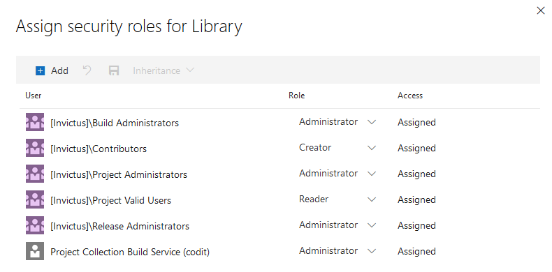

[home](../../README.md) | [framework](../framework.md) | [framework installation](framework-installation.md)

# Framework Release Pipeline

The release pipeline will use the artifacts created from the build pipeline and publish this to the stage(s) you define. Each stage will deploy the resources to the Azure subscription and resource group you specify in the deployment tasks.

## Variable Group

Create a variable group named `{prefix}.Invictus.{stage}` for all the stages (environments) and add at least one variable (eg: Invictus.Secrets.ApiKey1.Name = apikey1).

Make sure the Project Collection Build Service has Administrator access to these variable groups (Pipelines > Library > Security)

> 

## YAML Pipeline
Add the files and folders from [this](./pipelines) location to your DevOps repo. 
This contains an example YAML pipeline to release the Invictus for Azure Framework, change the [framework.release.yaml](./pipelines/framework.release.yaml) file according to your needs, for example change the needed environments and change the name of the build pipeline trigger:
``` yaml
resources:
  pipelines:
    # Name of the pipeline resource inside this workflow. Used to reference the pipeline resources later on (e.g. download artifacts).
  - pipeline: _build
    # Name of the build pipeline in Azure Pipelines
    source: 'customer.azure.invictus.framework.build' 
    trigger: true
```

:warning: Make sure to replace the `azureSubscription` value with the name of your serviceconnection as this value cannot be parameterized.

Also make sure to change the bicep template parameters according to your needs.


If you need to overwrite more bicep template parameters make sure to add this to the `deployScriptParameters`. A complete list of bicep template parameters can be found [here](#bicep-template-parameters). 

Afterwards add the [framework.release.yaml](./pipelines/framework.release.yaml) in your DevOps environment as a pipeline.

## Deploy Script Arguments

The following script arguments are used in the deploy script:

- **Mandatory Arguments**
  - `artifactsPath`: `$(ArtifactsPath)`
  - `resourcePrefix`: `$(Infra.Environment.ShortName)-$(Infra.Environment.Region.Primary.ShortName)-$(Infra.Environment.Customer.ShortName)`
  - `resourceGroupName`: name of the Azure Resource Group. Include the variable `$(Infra.Environment.ShortName)` to make this environment specific.
  - `variableGroupName`: The name of the variable group. Include the variable `$(Infra.Environment.ShortName)` to make this environment specific.
  - `identityProviderClientSecret`: Value can be obtained by following this guide: [Container Authentication](../../dashboard/containerAuthentication.md).
  - `identityProviderApplicationId`: Value can be obtained by following this guide: [Container Authentication](../../dashboard/containerAuthentication.md).
    
- **Optional Arguments**
  - `artifactsPathScripts`: uses ArtifactsPath when not specified.
  - `resourceGroupLocation`: `$(Infra.Environment.Region.Primary)` or 'West Europe' when not specified.
  - `additionalTemplateParameters`: Additional named parameters for the Bicep template you wish to override. More on this below.

The `AdditionalTemplateParameters` argument are named arguments you can use to override the default values used by the ARM template. You simply name the argument as the parameter. For example if you want to use a different servicePlanSku you would add `-eventHubSkuName "Standard"` to the arguments of the powershell script.

Complete example of the arguments (note the use of `-devOpsObjectId` as an additional parameter):

```powershell
PS> $(ArtifactsPath)/Deploy.ps1 `
-version ${{parameters.Version}} `
-location "West Europe" `
-useBeta ${{parameters.UseBeta}} `
-acrPath "invictusreleases.azurecr.io" `
-acrUsername $(Infra.Environment.ACRUsername) `
-acrPassword $(Infra.Environment.ACRPassword) `
-resourcePrefix $(Infra.Environment.ResourcePrefix) `
-artifactsPath $(Pipeline.Workspace)/_build/framework `
-resourceGroupName $(Infra.Environment.ResourceGroup) `
-variableGroupName invictus.$(Infra.Environment.ShortName) `
-devOpsObjectId "$(Infra.DevOps.Object.Id)" `
-identityProviderApplicationId "$(Infra.AzAD.Client.IdentityProviderApplicationId)" `
-identityProviderClientSecret "$(Infra.AzAD.Client.IdentityProviderClientSecret)" `
-containerAppsEnvironmentLocation "$(Infra.Environment.ContainerAppsEnvironmentLocation)"
```

## Bicep Template Parameters

The below table lists the parameters accepted by the Bicep template.

|Parameter Name|Required|Default Value|Description|
| --- | :---: | --- | --- |
|resourcePrefix|Yes||used as part of the default names for most resources.|
|timesequencerFunctionName|No|`invictus-{resourcePrefix}-timesequencer`|Name for the time sequencer function|
|sequenceControllerFunctionName|No|`invictus-{resourcePrefix}-sequencecontroller`|Name for the Sequence Controller function|
|xmlJsonConverterFunctionName|No|`invictus-{resourcePrefix}-xmljsonconverter`|Name for the XmlJson Converter function|
|xsdValidatorFunctionName|No|`invictus-{resourcePrefix}-xsdvalidator`|Name for the XSD Validator function|
|regexTranslatorFunctionName|No|`invictus-{resourcePrefix}-regextranslator`|Name for the Regex Translator function|
|transcoV2FunctionName|No|`invictus-{resourcePrefix}-transco-v2`|Name for the TranscoV2 function|
|pubsubV2FunctionName|No|`invictus-{resourcePrefix}-pubsub-v2`|Name for the PubSubV2 function|
|exceptionHandlerFunctionName|No|`invictus-{resourcePrefix}-exceptionhandler`|Name for the Exception Handler function|
|serviceBusNamespaceName|No|`invictus-{resourcePrefix}-sbs`|Name for the Service Bus Namespace resource|
|serviceBusSkuName|No|Standard or Premium if VNET enabled|Name for the Service Bus SKU|
|keyVaultName|No|`invictus-{resourcePrefix}-vlt`|Name for the Key Vault Service Namespace resource|
|keyVaultEnablePurgeProtection|No|null|If true, enables key vault purge protection. Once enabled, this property can never be disabled.|
|storageAccountName|No|`invictus{resourcePrefix}store`|Name for the Azure Storage resource. Any dashes (-) will be removed from {resourcePrefix}|
|blobContainerPrefix|No|invictus|Prefix set for blob containers for pubsub|
|appInsightsName|No|`invictus-{resourcePrefix}-appins`|Name for the Application Insights resource|
|servicePlanName|No|`invictus-{resourcePrefix}-appplan`|Name for the service plan which will host the APIs|
|serviceBusMessageTimeToLiveMinutes|No|-1|Time messages should be stored on service bus before being archived|
|storageAccountType|No|Standard_LRS|The Storage account StorageAccountSkuType|
|devOpsObjectId|Yes||The object-id associated with the service principal of the enterprise application that's connected to the service connection on DevOps|
|identityProviderClientSecret|Yes||AAD App Registration client secret required for Azure Container Apps Identity Provider authentication|
|identityProviderApplicationId|Yes||AAD Application ID for MSI Authentication of Azure Container Apps|

### VNET Specific Parameters

|Parameter Name|Required for VNET|Default Value|Description|
| --- | :---: | --- | --- |
|enableVnetSupport|Yes|false|Used to toggle VNET functionality on or off|
|vnetResourceGroupName|Yes|&nbsp;|The name of the resource group on Azure where the VNET is located|
|vnetName|Yes|&nbsp;|The name of the VNET resource|
|keyVaultSubnets|Yes|[]|An array of string. The values need to match the subnet names on the VNET|
|storageAccountSubnets|Yes|[]|An array of string. The values need to match the subnet names on the VNET|
|serviceBusSubnets|Yes|[]|An array of string. The values need to match the subnet names on the VNET|
|privateEndpointSubnetName|Yes||The name of the subnet to be used to connect the private endpoint resources|
|containerAppEnvironmentSubnetName|Yes|                               |The name of the subnet to be used to connect the container app environment|
|disableStorageAccountPublicNetworkAccess|No|false|If true, the Invictus storage account will not be accessible from a public network.|
|storageAccountMinimumTLSVersion |No|TLS1_2|Set the required TLS value for the storage account. Accepted values: TLS1_0, TLS1_1, TLS1_2|
|dnsZoneSubscriptionId|No|Subscription ID of scope|The subscription ID of the private DNS zones.|
|dnsZoneResourceGroupName|No|VNET RG name|The resource group name of where the private DNS zones are located.|
