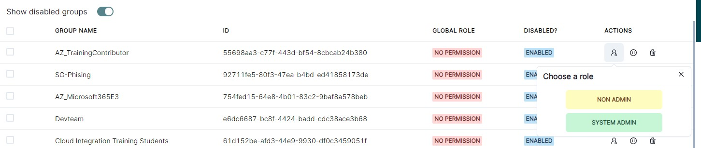

# Sync your Azure Active Directory groups to Invictus
> 👉 [Make sure that Invictus can access your Azure Active Directory](./azureADSetup.md)

Groups available in your Azure Active Directory will be used to determine whether users can access certain flows in the Invictus Dashboard. (See [flow permissions](../02_Flows/03_permissions.md)).

* [Add Azure Active Directory group](https://learn.microsoft.com/en-us/entra/fundamentals/how-to-manage-groups)
* [Add Azure Active Directory user](https://learn.microsoft.com/en-us/entra/fundamentals/how-to-create-delete-users)

To synchronize Azure Active Directory groups, go to **Groups** and click on **Sync all groups**.

> ☝️ Only groups of active users (Active Directory users that have already signed into the Dashboard) will be synced within the Dashboard.

## Enable only required groups
Once the groups are synced within the Dashboard, you have to manually enable the required groups which you want to use for [flow permissions](../02_Flows/03_permissions.md).

## Assign user role to required groups
Each enabled group requires a user role permission to indicate what authority each member of the group has throughout the Dashboard, [more info on Dashboard roles](../03_Security/role-management.md).

