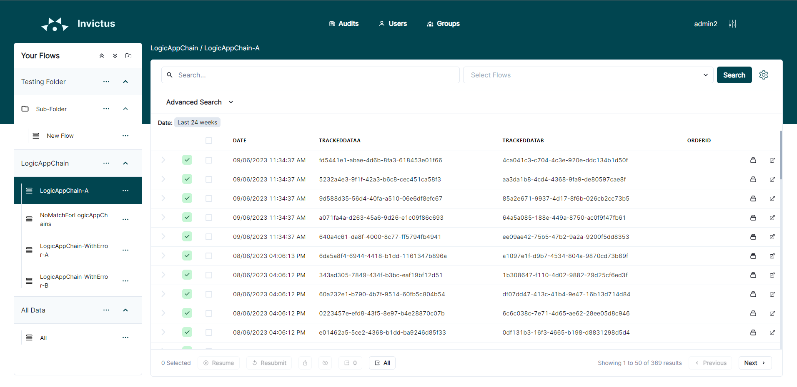
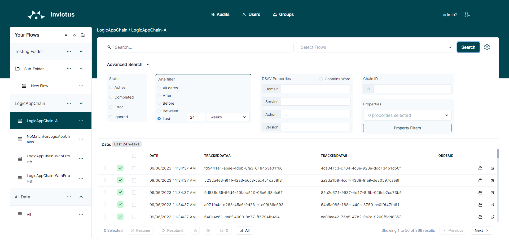
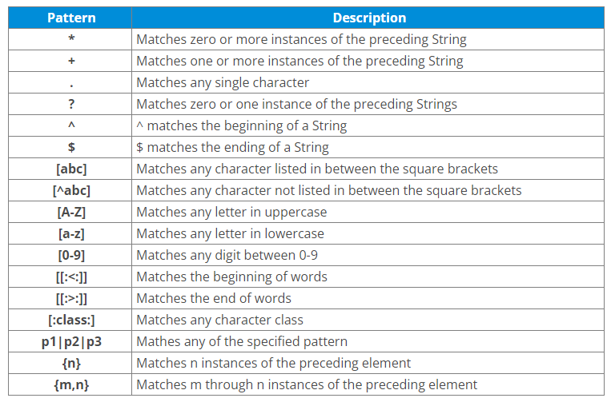
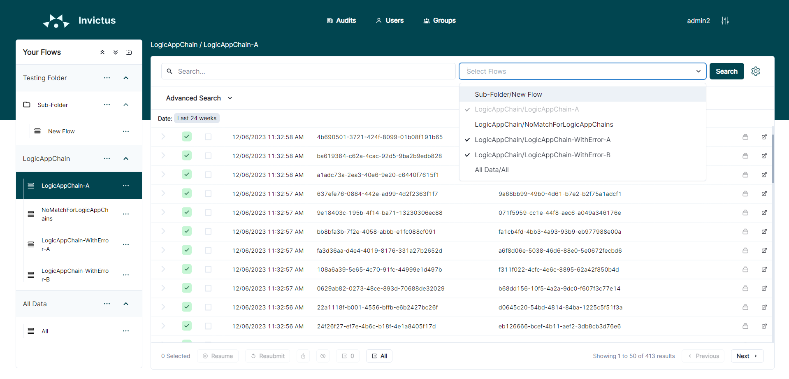

# Dashboard Search

## Basic Search

The user is able to perform a basic text search through the top search bar. This will search through all properties of the flow and will check if the property data contains the desired string. Click on the search button to perform your request.

No search query

With search query

## Advanced Search

Opening the advanced search pane will present the user with a selection of filters which can be applied to the flow data.

The following filters may be applied:

* **Date filter**: 5 options to choose from:
  * all
  * is after (start state)
  * is before (end date)
  * is in between (start date - end date)
  * is in the last (minute(s) - hour(s) - day(s) - week(s) - month(s)) |
* **Chain ID**: Filter by specific Chain ID
* **Status filter**: Filter to include only the selected status:
  * Active - Shows all messages which are being processed as active, resubmit request, resubmitted, resume request, resumed.
  * Completed - Shows all messages that are completed (processed successfully).
  * Error - Shows all messages that are suspended, dehydrated or terminated or request failed and resume failed.
  * Ignored -  Shows all messages that are ignored.
 * **Flow property filter**: Enables more detailed searching per property. First, select the properties you wish to search on from the dropdown. Then click on the property filters button. This will open a modal where the user may add the specific filter as described below: 
   * "Contains" - search within the specified business property that contains a specific word.
   * "Starts With" - search within the specified business property that starts with a specific word.
   * "Ends With" - search within the specified business property that ends with a specific word.
   * "Equal To" - search within the specified business property that matches exactly the specific word.
   * "Not Equal To" - search within the specified business property that doesn't match the specific word.
   * "Regex" - search within the specified business property by using regex pattern. You can use these patterns below.
   
  

## Search across flows

All of the above searching functionality can be applied to searches across multiple flows. Simply select the desired flows from the "Select Flows" dropdown. Results will be combined into a single table.

