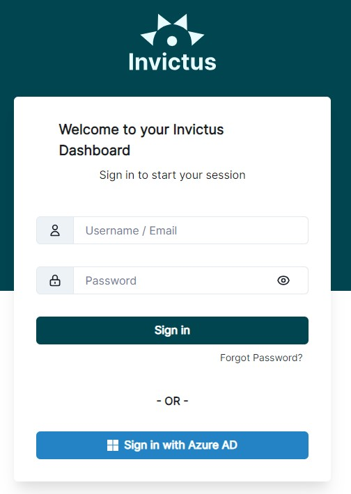
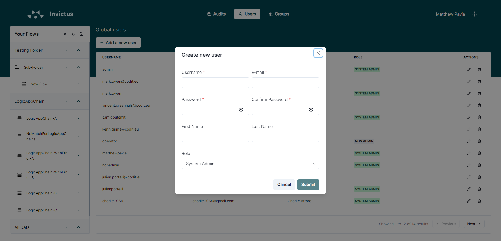

# Manage Users in the Dashboard
The Invictus Dashboard allows you to access the application with multiple user accounts. These can be local users, managed by Invictus itself; or **Active Directory** users, managed by your Azure tenant.

> 🎖️ We recommend using **Active Directory** users over local users for security reasons.

## Active Directory Invictus Dashboard users
> 👤 Requires membership of a synced Active Directory group

The Invictus Dashboard can be configured to [use existing users in Azure Active Directory groups](../01_Installation/azureADSetup.md). This removes the need to work with additional local Dashboard users.

### Add an Active Directory user to the Dashboard
Azure Active Directory users can sign in automatically into the Invictus Dashboard if that user is part of an Active Directory group that is [synced into the Dashboard](../01_Installation/groupmanagement.md).

> ☝️ Make sure that the group has a [role assigned](./03_roles.md), otherwise the Dashboard will be unusable for the user.

### Delete an Active Directory user from the Dashboard
> 👤 Requires group membership with `System admin` role to delete users

1. To delete a user click on the delete icon next to the user in the user list. Confirm your decision in the confirmation box.
  
    > 👀 Linked Active Directory users can be distinguished as they do not have a personal role assigned. The role is determined by the group the user is a member of.

### Edit an Active Directory user's role in the Dashboard
Active Directory users don't have personalized roles that allow them to access certain flows in the Dashboard. The user role is determined by the Active Directory group(s) where the user is a member of. [If the group(s) has access to the flow](../01_Installation/groupmanagement.md), so will the user.

## Local Invictus Dashboard users
> 👤 Requires personal `System admin` role to manage local users

Local users are entirely managed by the Invictus Dashboard. They can have their own personal permissions assigned and can be deleted at anytime.

To manage local users, go to the top navigation bar and click on the `Users` button. This brings you to the page that displays an overview of all the users that has access to your Dashboard. There is the option to `Add`, `Edit` or `Delete` users.

### Add a local user to the Dashboard

1. Click on the `Add a new user` button.
  

1. Specify all the user information and the [user role](./03_roles.md).
  

### Delete a local user from the Dashboard

1. To delete a user click on the delete icon next to the user in the user list. Confirm your decision in the confirmation box.
  
    > 👀 Local users can be distinguished as they have a personal role assigned.

### Edit a local user's role in the Dashboard

1. To edit a user click on the pencil edit icon next to the user in the user list
  

1. You can change the [role of the user](./03_roles.md) and save the changes. 
  
