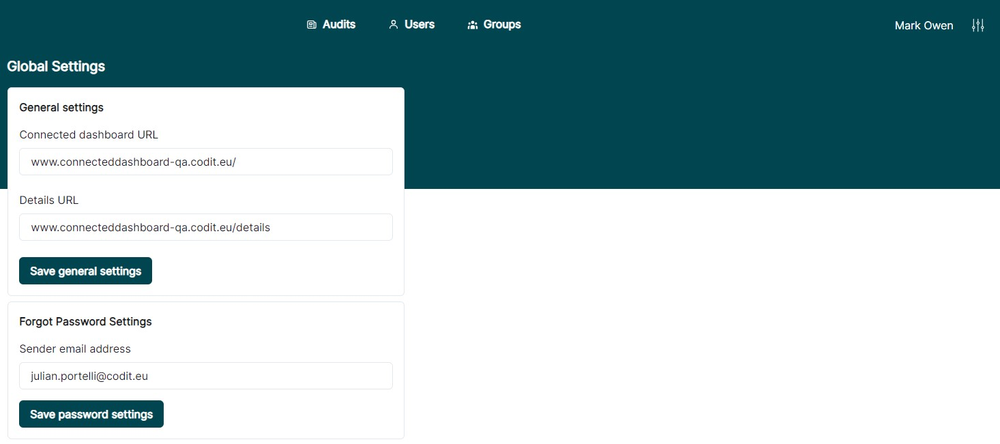
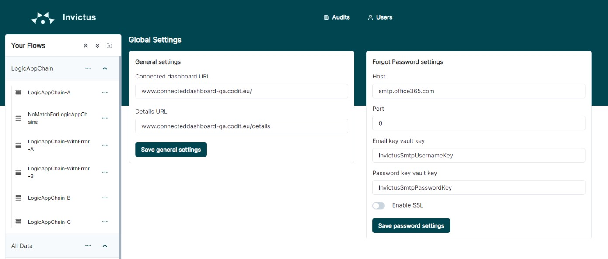
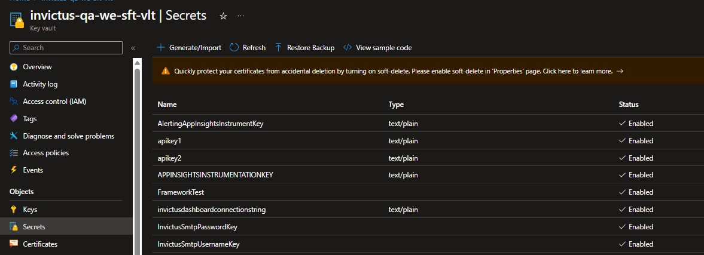
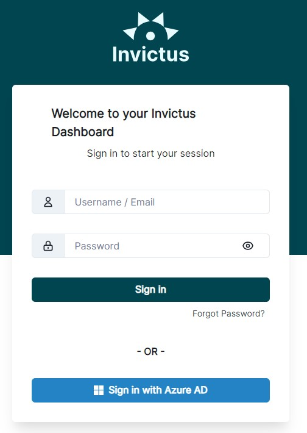
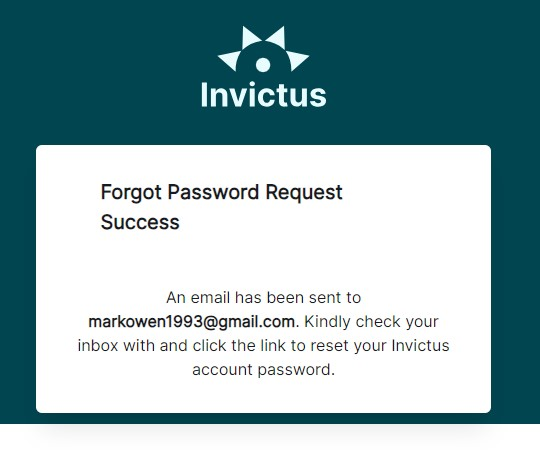
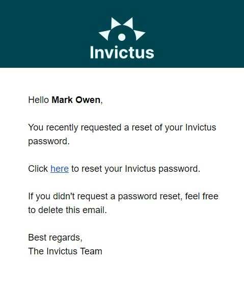

# Forgot Password
a
The forgot password feature can be set up using two different approaches: SMTP or Azure Active Directory with application registration and API permissions. The SMTP approach is to be used when Azure AD has not been enabled for your Invictus V2 installation.

In the below documentation the below topics are explained;

- Setting up SMTP to send emails
- Setting up Active directory with an application registration to send emails
- Forgot password user flow procedure

## Forgot Password - Active Directory Application Registration

Before you can use the forgot password feature, you need to create an Azure Active Directory application registration and set it up with the Mail.Send API permissions. This is required because emails can only be sent through an OAuth 2.0 flow. Previously, emails were sent using an SMTP client with a username, password, and SMTP connection. However, Microsoft and Google no longer allow this and are deprecating this service.

Please note that the permission granted allows any email address within the organization to be used as the sender.

To set up the Azure Active Directory application registration with the Mail.Send API permission, please follow the instructions [here](../01_Installation/azureADSetup.md).

## Setup Email Address as the Sender

To set up the email address as the sender, follow these steps:

1. Log in with an administrator account or any user with the role of System Admin.
2. Navigate to the settings page by clicking the controls located at the top right next to the account name.
3. In the **Forgot Password Settings** section, enter the email address you want to use.
4. Click on **Save password settings** to save the email address being used.

## Forgot Password - SMTP 

### Setting up Email Details

To configure the email settings, follow these steps:

1. **Access Dashboard**: Log in to the dashboard using a system admin account.

2. **Navigate to Settings**: Once logged in, navigate to the settings page. You'll find a form with the necessary details to complete.

     

3. **Fill in Details**:

   - **Host**: Enter the host address. For instance, if it's a Gmail email account, the host should be "smtp.gmail.com".
   
   - **Port Number**: The default port number is 587.
   
   - **Email API Key and Password API Key**: These keys are securely stored within the KeyVault service. Save the email address and password of the sending account within these secret keys.
   
   
   
   - **SSL Enabled**: It's recommended to enable SSL, as major email providers often require this setting. Ensure this option is checked.
   
4. **Save Changes**: Click the save button to store your settings.

# Forgot Your Password - User Flow

To reset your password, follow these steps:

1. Click on **Forgot Password?** to initiate the password reset process.
2. The form will be displayed, and you need to enter the email address associated with your account.

3. After submitting the form, a confirmation message will be displayed, indicating that the reset password request has been sent to the provided email address.

4. Access your email inbox and look for the email containing the reset password instructions. The email will have a template like the one shown below.

5. In the email content, click on the **here** hyperlink. You will be redirected to the reset password form, where you can enter your new password.

6. Once you have successfully entered your new password, you can proceed to log in with the newly registered password.
