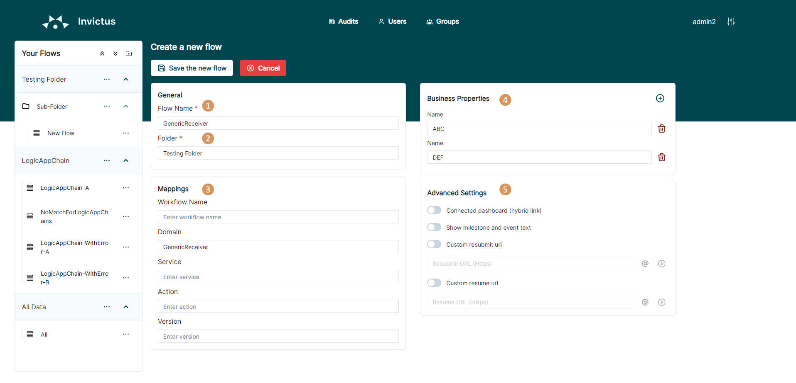
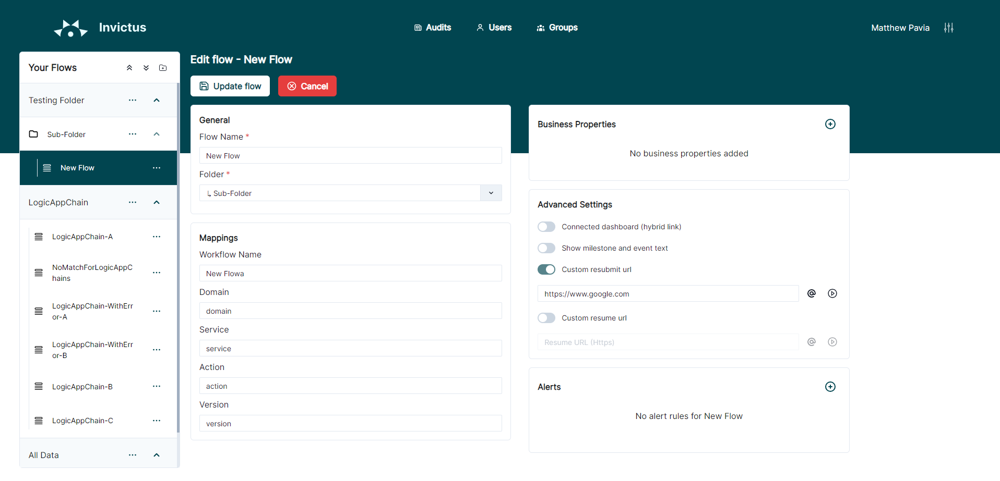

# Edit Flows
Each [folder](./home.md#organizing-flows-in-folders) can hold one or more 'flows'. These are message chains, an aggregation of all the messages that can be linked to the same incoming message. Flows are the functional representation of the message with an optional context property name and / or optional context property value.

## Add a new Flow
> 👉 **Home > Your Flows > ••• > Create New Flow**

> 

1. **Flow Name:** a case sensitive name of the flow (example: ex. invoice request, invoice approval, …)
2. **Folder:** the parent folder to add the flow to.
3. **Mapping**: defines how a flow, and the messages it contains, are stored and indexed.
4. **Business properties**: each mapping type contains a list of fields or properties pertinent to that type.
5. **Advanced Settings**
    * *Connected Dashboard*: if the flow has multiple dashboards and it needs to connect to another dashboard then this needs to be checked.  For this setting to apply, the Connected Dashboard needs to be enabled by your Admin through the settings page of the dashboard in order to switch on this feature.
    * *Show milestone and event text*: Checking this option will enable the flow milestone and event text data to be displayed.
    * *Custom resubmit/resume URLs*: Check these options and provide the necessary URLs to use your own resume and resubmit logic.

> 🔗 See [Alerting](#alerting) to manage alerts on the flow.

## Edit an existing Flow
> 👉 **Home > Your Flows > [Your Folder] > [Your Flow] > ••• > Edit/Delete Flow**

### Alerting
> ⚠️ To manage alerts within Flows, make sure the [necessary **role assignments** are set](./accesscontrolrights.md) in your Invictus installation.

1. **Alert Name:** The name for the rule, must be unique per flow. Name will automatically have the flow name added as a prefix to it.
2. **Severity:** Has to be a value between `1-4` which identifies the severity of an alert.
3. **Schedule:**
    * _Frequency:_ how often the rule is executed - value must be between the range of `5-1440`.
    * _Time window:_ range that Azure uses, the logs for the last x minutes - value must be between the range of `5-2880`.
4. **Trigger:**
    * _Threshold Operator:_ The values available are: `Equal`/`GreaterThan`/`LessThan`, these operators are used along with the _Threshold_ field to check if a rule needs to be triggered or not.
5. **Throttling:** 
    * _Suppress alerts (minutes):_ The minutes value set here is used to suppress alerts for x minutes if alerts for a rule have been triggered.
6. **Query:**
    * _Type:_ This value is used to select which type of query the alert rule will have `AzureResultCount`/`InvictusActivityCheck`/`InvictusErrorCheck` - AzureResultCount lets the user enter custom script which is accepted by the Azure Rule Syntax. The ones starting with `Invictus...` are pre-made scripts for the user to select without having to modify.
7. **Recipients:** the email recipients to notify when the rule is triggered.

#### Query type description

`Invictus Activity Check`

This query type will filter logs on Azure Logs by the "InvictusImportJobFlowActivityAlert" property. The ImportJob will log activity for any flows that are active every hour. An example of how the alert settings for this flow could be set:

- Frequency: 60
- Time Window: 60
- Trigger Threshold Operator: LessThan
- Threshold: 0

This will create a rule to run every 60 minutes, scans the logs for the last 60 minutes and if the returned value is less than the threshold, it means that the flow is inactive, thus triggers the alert on Azure.

Please note that the importjob will not increment the activity for each message that is processed for a flow. This simply sends a single log per hour for each flow that is active, the count might be higher than one per hour due to scaling situations and multi-threaded scenarios. The logging frequency for the importjob can be increased by reducing the following value: **FlowActivityIntervalInMinutes**. This can be passed to the ARM template during deployment.

`Invictus Error Check`

This query type will filter logs on Azure Logs by the "InvictusImportJobFlowErrorAlert" property. The ImportJob will log a message for each Flow that triggers an error. An example of how the alert settings for this flow could be set:

- Frequency: 10
- Time Window: 10
- Trigger Threshold Operator: GreaterThan
- Threshold: 0

This will create a rule to run every 10 minutes, scans the logs for the last 10 minutes and if the returned value is greater than the threshold, it means that the flow has failed messages, thus triggers the alert on Azure.

`AzureResultCount`

This will enable custom scripts with the Azure Alert syntax. If you require further information about this type of syntax please refer to the official documentation by Microsoft.