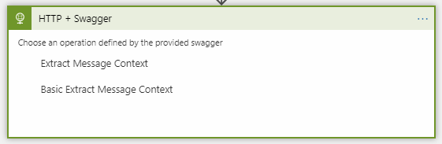

# Matrix - Promotion

> ## ⚠️ Attention
> This is the V1 version of the Matrix, which is deprecated and will thus no longer be extended.
> 
> Maximum supported .NET version is .NET Framework 4.7.1
> 
> For the supported version, please see [Transco Matrix V2](../transcoV2-Matrix.md)

## Introduction

This documentation will give you an overview of the Matrix and will help you setup a Logic app and use the Promote Action

### ID default Behavior

The below table applied to: ConversationId, CorrelationId, BatchId

|Provided in Context|Provided in Textbox|Result|
|--- |--- |--- |
|Yes|Yes|Value of Logic App Textbox input|
|Yes|No|Value of Context|
|No|Yes|Value of Textbox input|
|No|No|Auto Generated|

## Creating a new Logic App & Using Matrix Connectors

1. Start by creating a new Blank Logic App From Azure Portal
2. Click on Edit to open the LogicApp Designer, if asked what type of template you want, choose blank

   

3. The first step when starting a new Logic app is to add a **Trigger.** A logic app must always start with a Trigger connector.
4. Since the publish is **not** a **trigger** but an action we will need to choose a trigger from the list available. For this example we will add a **Request** trigger
5. Setup the HTTP Request as seen in the image below. The Request Body is basically the schema of the json you will be Posting to this connector

   

6. After setting up the above trigger, we will now add an action connector. We will now use the Publish connector which uses the InvictusFramework API. All this is abstracted but in reality, all calls act exactly like API calls
7. Click on **New Step** and select **Add an action**
8. Choose Http+Swagger

   

9. Then choose the function you wish to use as a connector. For this example choose **Extract Message Context**

   

10. Populate the fields with the parameters you wish to pass

    

11. Notice that Content was wrapped in base64. The reason this needs to be done is because Publish takes a byte\[\] as input for **Message Content**. The Context object is simply passed without modification, this is expected to be a key value pair list.

    

12. Also set the **Promoter Config.** This list is loaded from the Azure Blob Storage container **matrixconfigsstore. If no items are present in the list simply import the desired configs to the container. Make sure that the configs are valid Matrix Promote xml files. Enter custom value is also possible if the selection of the file is dynamic, but you must ensure that this value matches the name of the desired blob.
13. By clicking **Show advanced options**, you will get to see more properties which most of the time are not required.

    

14. Although Authentication can be found under advanced, since the API which is exposing the custom connectors is using Basic Authentication, this has to always be populated. Use the below Json structure to setup Basic Auth for the connector.

     

15. The password for the API can be retrieved from AzureKeyVault by using either ApiKey1 or ApiKey2

     

16. At this point you can continue adding more actions if required. For this example this will conclude the use of the Promote Connector.
17. Click Save

## JSON Support

JSON support has also been added to the Matrix Component. The Message content can now be in **JSON** format. Do keep in mind that the config still needs to remain in XML format, the new change is that now XPathQuery can be replace with JPathQuery and its inline test has the be a jPath. Also, the **RetrieveMethod** must be set to **Jpath**.


## Transco Support

Transco extraction is now also supported with Matrix. It is suggested to first read the Transco user guide before attempting to use it with Matrix. Since this requires the Codit.BTS.Transco.Root database along with the DBAlias table, attempting to use it without these set up will always result in a failuire. This is all explained in the Transco section. The image below is just an example:


## Test

To test this Logic App and ensure your API is functioning

1. Start Postman
2. Get the url from the Http Trigger and set it in your postman url section
3. Set your action as POST
4. Select Body, choose **RAW** and set type to **application/json**
5. Upload the below config section to the container mentioned above - Save it to an .xml file
6. Ensure that the below config is selected in your Logic App
7. Post the Sample request below to your Logic App
8. You should get the response below, notice that "CountryName":"GBP" has been added to your context

MandatoryJson.xml

```xml
<?xml version="1.0"?>  
<XPathPromotorConfig xmlns:xsi="http://www.w3.org/2001/XMLSchema-instance" xmlns:xsd="http://www.w3.org/2001/XMLSchema" xmlns="http://www.codit.be/Schemas/XPathPromotor">  
<Property DynamicPropertyName="false" Name="CountryName" DataType="string" RetrieveMethod="Jpath" PropertyNamespace="" PromoteEmptyValue="false" Active="true">  
<JPathQuery Mandatory="true" Comment="" Source="Message">Money.Currency</JPathQuery>  
</Property>  
<TranscoOptions>  
<Caching CachingType="Default" CachingDuration="0" xmlns="http://www.codit.be/Schemas/Transco" />  
<Streaming UseStreaming="false" xmlns="http://www.codit.be/Schemas/Transco" />  
</TranscoOptions>  
</XPathPromotorConfig>
```

Sample request

```json
{  
      "Content": "ew0KICAiQ291bnRyeUNvZGUiOiAiQkUiLA0KICAiTW9uZXkiOiAgeyAiQW1vdW50IjogIDUwLCAiQ3VycmVuY3kiOiAgIkdCUCIgIH0NCn0NCg==",  
       "Context": {  
        "x-conversationId": "29500405-d7cf-4877-a72b-a3288cff9dc0",  
        "x-correlationId": "fc13d345-ebd7-44f2-89a9-4371258c0a08",  
        "x-batchId": "975f7ea4-6247-431b-afb6-6d27fb47516f",  
        "x-applicationName": "InvoiceApp",  
        "filter": "1"  
    },  
  "PromoterConfig": "mandatoryJson.xml"  
}
```

Expected Response

```json
{  
    "Content": "ew0KICAiQ291bnRyeUNvZGUiOiAiQkUiLA0KICAiTW9uZXkiOiAgeyAiQW1vdW50IjogIDUwLCAiQ3VycmVuY3kiOiAgIkdCUCIgIH0NCn0NCg==",  
    "Context": {  
        "x-conversationId": "29500405-d7cf-4877-a72b-a3288cff9dc0",  
        "x-correlationId": "fc13d345-ebd7-44f2-89a9-4371258c0a08",  
        "x-batchId": "975f7ea4-6247-431b-afb6-6d27fb47516f",  
        "x-applicationName": "InvoiceApp",  
        "filter": "1",  
        "CountryName": "GBP"  
    },  
    "ConversationId": "29500405-d7cf-4877-a72b-a3288cff9dc0",  
    "CorrelationId": "fc13d345-ebd7-44f2-89a9-4371258c0a08",  
    "BatchId": "975f7ea4-6247-431b-afb6-6d27fb47516f"  
}
```
